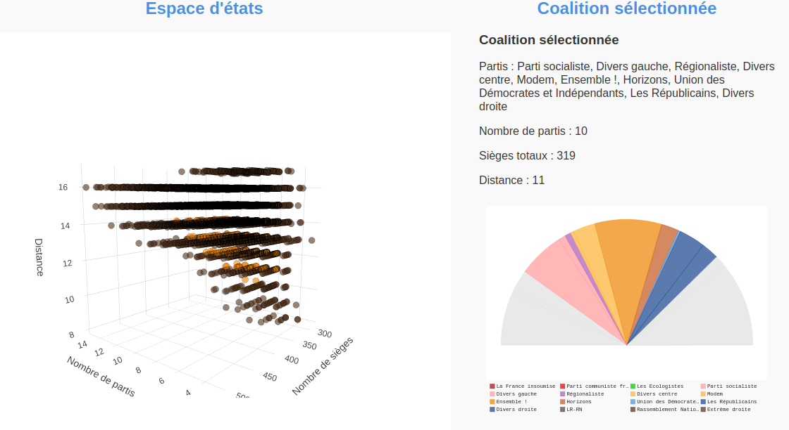

# Simulateur de Coalitions à Majorité Absolue

Bienvenue dans le Simulateur de Coalitions à Majorité Absolue! Ce projet est une application web conçue pour explorer les possibilités de coalition politique après les élections législatives de 2024 en France. L'objectif est de permettre aux utilisateurs d'évaluer diverses combinaisons de partis politiques et leur impact potentiel sur la composition du gouvernement.

## Fonctionnalités

- **Exploration des Coalitions :** Découvrez trois types de coalitions optimales en fonction de critères comme le nombre de partis, le nombre de sièges et la distance politique.
- **Visualisation de l'Espace d'État :** Graphique interactif montrant la distribution des coalitions avec une majorité absolue.
- **Détails Interactifs :** Obtenez des informations détaillées sur chaque coalition en cliquant sur les points du graphique.

## Comment Utiliser

1. **Accès à l'Application :** Visitez [Simulateur de Coalitions](https://briaslab.pythonanywhere.com/) pour utiliser l'application.
2. **Sélection des Paramètres :** Utilisez les options pour définir des contraintes entre certains partis politiques (ex: RN, LFI, etc.) avant de lancer la simulation.
3. **Exploration des Résultats :** Explorez les différentes configurations politiques possibles et comprenez mieux les dynamiques de coalition post-électorale.

## Captures d'Écran

*Exemple de graphique d'espace d'état montrant la répartition des coalitions.*

## Technologies Utilisées

- **Frontend :** HTML, CSS, JavaScript (Plotly.js pour les graphiques interactifs)
- **Backend :** Python (Flask framework)
- **Déploiement :** PythonAnywhere

## Contribuer

Si vous souhaitez contribuer à ce projet, vous êtes les bienvenus! Voici comment vous pouvez démarrer :

1. Clonez ce dépôt : `git clone https://github.com/antoinebrias/coalition.git`
2. Installez les dépendances nécessaires : `pip install -r requirements.txt`
3. Modifiez, améliorez, et soumettez une pull request!

## Auteur

Ce projet a été développé par Antoine Brias. Vous pouvez me contacter sur [LinkedIn](https://www.linkedin.com/in/antoine-brias-2b64841a9/) pour toute question ou suggestion.

## Licence

Ce projet est sous licence MIT - voir le fichier [LICENSE](LICENSE) pour plus de détails.
